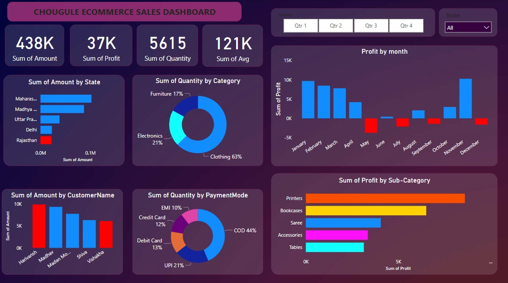
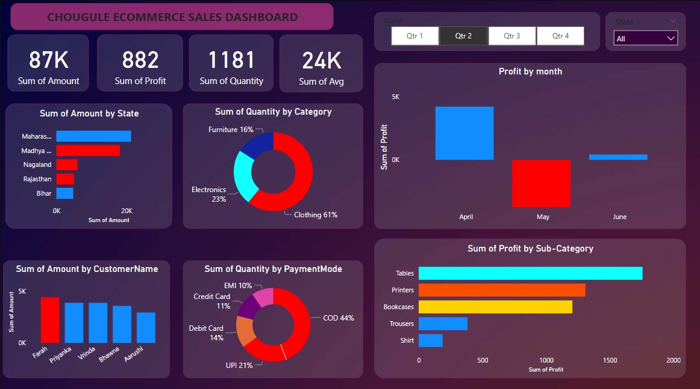
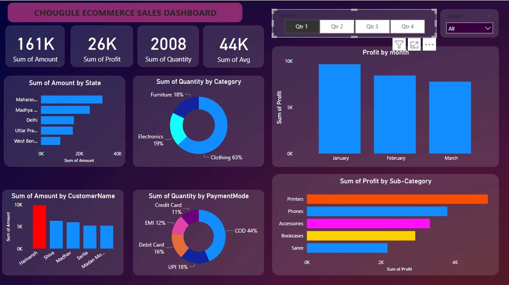

# 📊 Chougule's Ecommerce Sales Dashboard

This repository contains a Power BI dashboard project titled **"Chougule's Ecommerce Sales Dashboard"**, which provides visual insights into ecommerce sales, profits, and quantities across multiple dimensions such as geography, time, customer, and product categories.

---

## 📷 Preview

## 📷 Output 1

---

## 📷 Output 2

---

## 📷 Output 3

 
---

### 🎬 Click below to watch the video  
[Output4.mp4](Screenshots/Output4.mp4)

---

## 📁 Files Included

- `Chougule_Ecommerce_Dashboard.pbix` – Power BI Desktop report file
- `sample-dataset.xlsx` – (Optional) A demo dataset used to simulate the visuals (not included if data is confidential)
- `POwerBI Chougule Dashboard.png` – Dashboard preview image

---

## 📌 Dashboard Overview

The dashboard is designed to help stakeholders understand and explore:
- Total **Sales Amount**, **Profit**, **Quantity Sold**, and **Average per Sale**
- Performance by **State**, **Customer Name**, and **Category**
- Profit trends **month-wise**
- **Sub-Category level** profitability
- Payment mode and category preferences

---

## 🧩 Dashboard Pages & Visuals

### Key Visuals on the Main Page:
- ✅ KPIs for: 
  - **Sum of Amount**
  - **Sum of Profit**
  - **Sum of Quantity**
  - **Sum of Average**
- 📍 **Bar chart**: Sales by Indian States
- 🧑‍💼 **Bar chart**: Sales by Customer Name
- 🛍️ **Donut charts**:
  - Quantity by Category (Clothing, Furniture, Electronics)
  - Quantity by Payment Mode (EMI, COD, Credit Card, etc.)
- 📈 **Column chart**: Monthly Profit Trend
- 📊 **Bar chart**: Profit by Sub-Category (Printers, Saree, Accessories, etc.)
- 📅 Filters: Quarter and State dropdown filters for interactive slicing

---

## ⚙️ Requirements

To open or edit the `.pbix` file, you will need:
- [Power BI Desktop](https://powerbi.microsoft.com/en-us/desktop/) (free)

---

## ⚠️ Data Disclaimer

> **Note:** The original Excel file used in this project is not included due to privacy or unavailability.  
> The `.pbix` file contains the loaded data, so the visuals will display correctly, but **data refresh may not work** unless the Excel file is reconnected or replaced.

If you’d like to use this dashboard with your own dataset:
1. Open the `.pbix` file in Power BI Desktop
2. Go to **Transform Data > Edit Queries**
3. Replace the missing source with your own Excel or database file
